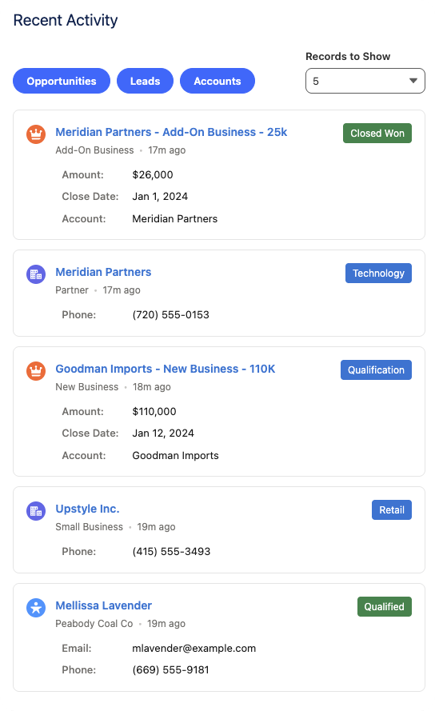
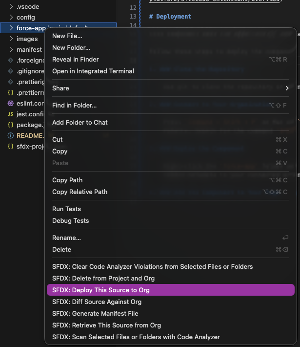
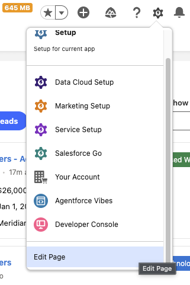
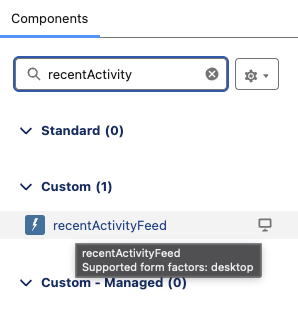

# Recent Activity Feed Demo Component

A quick demo component that shows any recently modified Opportunities, Leads or Accounts inside the Salesforce organization.

Supports filtering the activity based on the records' object types.

# VS Code for Salesforce DX Setup

[Resources for installing VSCode for Salesforce DX projects](https://developer.salesforce.com/docs/platform/sfvscode-extensions/overview)

# Deployment

This component uses the Opportunity, Lead and Account objects from Sales Cloud.

Follow these steps to deploy the component to your organization.

1. ### Clone the Repository

    Use git to clone the repository or download it and open it in Visual Studio Code.

2. ### Connect to Your Organization

    Press `Command + Shift + P` on Mac or `Control + Shift + P` on Windows to bring up the Command Palette. Search for the command `SFDX: Authorize an Org` and run it.

3. ### Deploy the Component

    Right-click the `force-app` folder and select `SFDX: Deploy This Source to Org` to deploy the component and the Apex class to your org.

    

4. ### Add the Component to Your Page

    Navigate to a page inside your organization where you want to add the component to.

    Click the gear icon (cogwheel) on the top right and select `Edit Page` to access the Lightning App Builder for the page.

    

    When the builder loads, search for a custom component called `recentActivityFeed`.

    NOTE: Loading the custom component list might take a moment.

    

    Drag and drop the component into the page and click `Save`